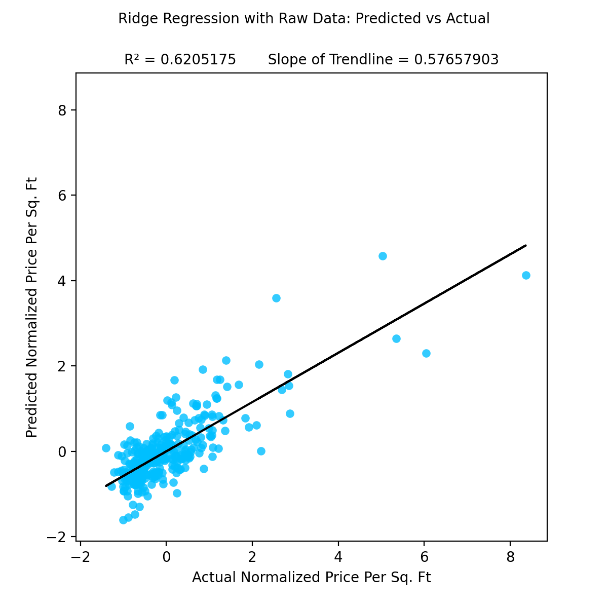

# Predicting Housing Prices in US Counties from US Census Data and Other Local Features:
## Members:
- Ethan Bolton
- Carlo Casas
- Evan Chase
- Felix Pei
- Sagar Singhal

---

## Background and Problem Definition
Understanding how housing prices correlate with demographics can help to predict how property values will adjust to changes in the population, income, ethnicity, areas of employment, and other features of an area. This insight can help investors in real estate decide where to buy and sell property and could inform governments on how they can make housing more affordable. Additionally this tool could be used to predict future changes rent before rent is adjusted to correspond with local changes in an area.

This project aims to predict housing prices of counties in the United States given demographic data and discover relevant correlations using supervised machine learning with the American Community Survey of 2015 and the Zillow Rent Index, which tracks the median housing price per square foot of a given area.

## Data Collection and Preprocessing
Two different datasets from Kaggle were selected in this analysis -- the [2015 U.S Census](https://www.kaggle.com/zillow/rent-index) and the [Zillow Rent Index](https://www.kaggle.com/muonneutrino/us-census-demographic-data). 

The Zillow Rent Index has two collections, median estimated monthly rental price for a given city/town and median estimated monthly rental price per square foot for a given city/town.
Much of this data has been prescreened and cleaned by Zillow by removing outliers and weighting the homes that actually rent as higher. The data provided details the Rent Index for each month for each U.S City (and corresponding county which will be used to match with the census) from 2010 to 2017. The data has 13131 unique cities and 1820 counties.
In order to get the rent per county as opposed to city/town we build county data from the averages of cities contained in the same county.

The U.S Census dataset includes several demographic features of counties. This source also included a collection with breakdown by census tracts (which are much smaller than counties), however we decided to only use the collection with data for full counties. This allows us to more easily make comparisons across datasets.
These columns include information such as median household income, racial demographics, poverty rates, profession, and commuting habbits (drive, transit, walk, commute time, etc.).

To clean the data, the first thing we did was remove the counties that don't overlap between the two data sets. The datasets were then sorted and combined into one, with each numerical column normalized.
We have implemented several feature selection methods: forward selection, backward selection, and lasso selection.

## Methods
Our problem is a regression problem, where we attempt to approximate the relationship between independent variables (population, etc.) and a dependent variable (median rent).

Next, we need to learn a mapping from the input features to the output. There are many approaches we can choose from for this regression task. From linear approaches, we can experiment with simple linear regression, Lasso regression, and GLMs like Gamma regression. Among non-linear approaches, we can try support vector regression and feedforward neural networks, and we can also use additional input features generated from non-linear transformations of original inputs with the linear methods. Afterward, we can compare training time and performance of these various approaches, and we can probe the trained models to see what features are particularly informative of the output.

## Results and Discussion
R2 is a stastical measure representing the the extent to which the variance in one variable explains the variance in another variable. R2 is commonly used as an alternative to Mean Squared Error for analyzing regression models, as it is not scaled by the scale of its inputs.

To analyze the effectiveness of the Ridge Regression models, we have collected the R2 values of 1000 models of each type in order to negate variance created by the use of different train/test splits of the collected data.

The average R2 value for models using raw data was **0.60133236** with a standard deviation of **0.07622105**

The average R2 value for models using only forward selection features was **0.59631823** with a standard deviation of **0.07786187**

The R2 value of approximately **0.60** shows that over half of the variation amongst the data can be explained by the model's inputs. This relationship between the demographic data which has been collected and the average price per sq. ft in a county as recorded by the Zillow Rent Index is encouraging in showing the effectivity of regression models utilizing the dataset.

With the reduction of features using forward selection, a hope was to see an increase in the value of R2 for the model. As the values for R2 for each model were within the standard deviations from the mean, there is negligble difference in the determination coefficient using forward selection features. While this aspect was not improved, an analysis of the **Predicted Normalized Price Per Sq. Ft** versus the **Actual Normalized Price Per Sq. Ft** for each model shows a tendency to underestimate when making predictions. A trendline with a slope of 1 shows neither a tendency to underestimate or overestimate. The use of forward selection features increased the slope of the trendline from **0.57657903** to **0.755802** showing significant reduction of the tendency to underestimate.

## Conclusion
The creation of our first model has given us a positive outlook on the effectiveness that our future models can have. The R2 of 0.60 shows a level of determination which can be predicted on between our model's inputs and the average price per sq. ft in a county as recorded by the Zillow Rent Index. The reduction in the tendency to underestimate provided by the use of forward selection features is hopeful in showing us that fine-tuning of our models in the future can yield positive results. The creation of additional models in the future through the use of other machine learning techniques will allow us to measure correlations present in our collected data in different ways and produce stronger results.

## Proposed Timeline
### Project Proposal (10-7)

The main idea of what our project - estimating rent based on the defining parameters of a County in the US - will consist of. This will be a good guideline for the steps we need to take in the project.

| Background and Problem Definition | Methods | Potential Results and Discussion | References | Timeline | Proposal Video |
| --------------------------------- | ------- | -------------------------------- | ---------- | -------- | -------------- |
| Sagar | Felix | Evan | Sagar | Carlo | Ethan |

### Pre-Processing (10-22)
We plan to collectively work to clean the data and manipulate it into a format that we can easily use in our models. Within this group effort, Felix and Carlo will take the numerical data and normalize it while Sagar and Ethan do similar manipulation with the empirical data. Once this is done we need to combine the data we have from two separate datasets into a form we can work with together more easily in the final model - Evan's role. 

### Project Midpoint Report (11-16)
At this point we hope to have tried various methods for predicting output from all or some of our variables. It is difficult to say how much will be completed at this point with little guidelines up to this point, but even without a fully optimum model or solution, we at least hope to have some results to show at this milestone. We each plan to try to fit our data to one model or another. Sagar and Ethan will attempt as many linear approaches as possible while Felix, Carlo, and Evan plan to do the same with non-linear methods. 

### Final Project (12-7)
With the final project, the main step from the midpoint report will hopefully be optimization and a finalized algorithm for producing more accurate predictions. With a finalized algorithm, hopefully we can not only predict an output from the others, but know which parameters have the greatest impact on our output. After the midpoint report we will collectively choose which model fits our needs best and work together to optimize the hyperparameters. 

---

## References
MuonNeutrino. (2019). US Census Demographic Data (Version 3) [Data file] Retrieved from https://www.kaggle.com/muonneutrino/us-census-demographic-data.

US Census Bureau. (2019) ACS Demographic and Housing Estimates https://data.census.gov/cedsci/table?q=demographic&tid=ACSDP1Y2019.DP05

Schuetz, Jenny. “How Can Government Make Housing More Affordable?” *Policy 2020: Voter Vials*, Brookings, 15 Oct. 2019, https://www.brookings.edu/policy2020/votervital/how-can-government-make-housing-more-affordable/.

Zillow Group. (2017). Zillow Rent Index, 2010-Present (Version 1) [Data file] Retrieved from https://www.kaggle.com/zillow/rent-index.
