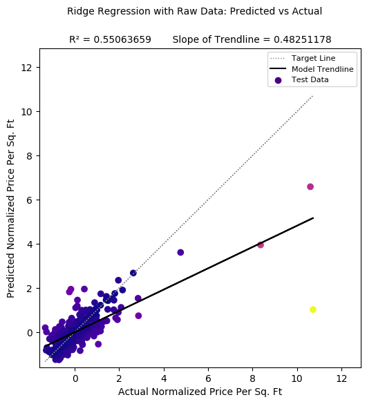
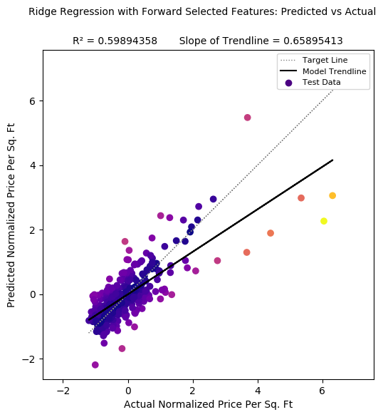

# Predicting Housing Prices in US Counties from US Census Data and Other Local Features:
## Members:
- Ethan Bolton
- Carlo Casas
- Evan Chase
- Felix Pei
- Sagar Singhal

---

## Background and Problem Definition
Understanding how housing prices correlate with demographics can help to predict how property values will adjust to changes in the population, income, ethnicity, areas of employment, and other features of an area. This insight can help investors in real estate decide where to buy and sell property and could inform governments on how they can make housing more affordable. Additionally this tool could be used to predict future changes rent before rent is adjusted to correspond with local changes in an area.

This project aims to predict housing prices of counties in the United States given demographic data and discover relevant correlations using supervised machine learning with the American Community Survey of 2015 and the Zillow Rent Index, which tracks the median housing price per square foot of a given area.

## Data Collection and Preprocessing
Two different datasets from Kaggle were selected in this analysis -- the [2015 U.S Census](https://www.kaggle.com/zillow/rent-index) and the [Zillow Rent Index](https://www.kaggle.com/muonneutrino/us-census-demographic-data). 

The Zillow Rent Index has two collections, median estimated monthly rental price for a given city/town and median estimated monthly rental price per square foot for a given city/town.
Much of this data has been prescreened and cleaned by Zillow by removing outliers and weighting the homes that actually rent as higher. To create the index, Zillow weights every home in a given region that has a Rental Zestimate and aggregates them. The data provided details this Rent Index for each month for each U.S City (and corresponding county which will be used to match with the census) from 2010 to 2017. The data has 13131 unique cities and 1820 counties. In order to get the rent per county as opposed to city/town we build county data from the averages of cities contained in the same county.

The U.S Census dataset includes several demographic features of counties. This source also included a collection with breakdown by census tracts (which are much smaller than counties), however we decided to only use the collection with data for full counties. This allows us to more easily make comparisons across datasets.
These columns include information such as median household income, racial demographics, poverty rates, profession, and commuting habbits (drive, transit, walk, commute time, etc.).

To clean the data, the first thing we did was remove the counties that don't overlap between the two data sets. The datasets were then sorted and combined into one, with each numerical column normalized.

## Methods
Our problem is a regression problem, where we attempt to approximate the relationship between independent variables (population, etc.) and a dependent variable (median rent).

Next, we need to learn a mapping from the input features to the output. There are many approaches we can choose from for this regression task. From linear approaches, we can experiment with simple linear regression, Lasso regression, and GLMs like Gamma regression. Among non-linear approaches, we can try support vector regression and feedforward neural networks, and we can also use additional input features generated from non-linear transformations of original inputs with the linear methods. Afterward, we can compare training time and performance of these various approaches, and we can probe the trained models to see what features are particularly informative of the output.

## Results and Discussion
### Linear Approaches
R2 is a stastical measure representing the the extent to which the variance in one variable explains the variance in another variable. R2 is commonly used as an alternative to Mean Squared Error for analyzing regression models, as it is not scaled by the scale of its inputs.

To analyze the effectiveness of the regression models, we have collected the R2 values of 1000 models of each type in order to negate variance created by the use of different train/test splits of the collected data.

#### Linear Regression
We started by using a simple linear regression model on our data.
On average the linear model was able to achieve an average R2 value of **0.60042954** (with standard deviation: 0.07686186).

We also used this linear model to test how effective our feature reduction worked on our data.
When using features selected by our feed forward feature reduction process the average R2 value was **0.59755995** (with standard deviation: 0.07512821).
This shows that in many cases the feature reduction actually ***decreases*** accuracy.

Below are two examples of reuslts from an instance of our linear regression model, one with full features and one with reduced features (reduced by our feedforward implementation):

#### Ridge Regression
The average R2 value for models using raw data was **0.60133236** with a standard deviation of **0.07622105**

The average R2 value for models using only forward selection features was **0.59631823** with a standard deviation of **0.07786187**

The R2 value of approximately **0.60** shows that over half of the variation amongst the data can be explained by the model's inputs. This relationship between the demographic data which has been collected and the average price per sq. ft in a county as recorded by the Zillow Rent Index is encouraging in showing the effectivity of regression models utilizing the dataset.

Below are two examples of reuslts from an instance of our ridge regression model, one with full features and one with reduced features (reduced by our feedforward implementation):

With the reduction of features using forward selection, a hope was to see an increase in the value of R2 for the model. As the values for R2 for each model were within the standard deviations from the mean, there is negligble difference in the determination coefficient using forward selection features. While this aspect was not improved, an analysis of the **Predicted Normalized Price Per Sq. Ft** versus the **Actual Normalized Price Per Sq. Ft** for each model shows a tendency to underestimate when making predictions. A trendline with a slope of 1 shows neither a tendency to underestimate or overestimate.

#### Lasso Regression
We implemented a lasso regression model for our data.
When testing a range of alpha value we found that with a max R2 value of **0.65810032** the optimal alpha value appears to be around **0.01**.

When testing on 10,000 instances of our lasso regression model with an alpha of **0.01** there was a mean R2 value of **0.60429626** with a standard deviation of **0.07495765**.
This suggests that at best out lasso regression model performs only very marginally better than linear and ridge regression.

#### GLMs
GLMs, such as Poisson and Gamma regression, are an extension of linear regression that may use link functions
to relate the target variable to the linear output and can support non-Gaussian noise assumptions. 
Housing prices are constrained to be greater than 0, but the output of linear regression is not
bounded. In contrast, Gamma regression outputs are limited to non-negative values, making it
potentially better-suited to this regression problem.

We applied Gamma regression to the data, optimizing the regularization parameter with a cross-validated
gridsearch. We achieved a mean R2 value of **0.71209392** with a standard deviation of 0.08382044,
substantially outperforming the other linear models.

### Non-Linear Approaches

#### Support Vector Regression
Using GridSearchCV (and thanks to the relative speed of fitting the SVR model) we were able to test many combinations of hyperparameters to settle on a C of **10000** and a gamma of **0.0001** to get a model that fit our test data with competitive accuracy to the other models we implemented. 

#### Neural Networks
We implemented a neural network model using the TensorFlow Keras API with a Stochastic Gradient Descent optimization function to see if there is another level of determination between the available demographic data and the Zillow Rent Index average price per sq. ft in a county. 

In creating a deep learning model, experimentation with how many layers and how many nodes per layer to use is reagrded as an acceptable way to discover what structure of model works best with the given data. We found that 8 hidden layers with 200 nodes per layer provides for the highest accuracy, with further increases in the number of layers or nodes leading to overfitting and subsequent decreases in test accuracy. 

Mean Absolute Percentage Error (MAPE) is a metric representing prediction accuracy which is not scaled by the numeric size of values, unlike other commonly used metrics, such as Mean Squared Error (MSE). In creating the neural network model, a MAPE of **14.0530%** was achieved when evaluating the model with test data.

The R2 value for this model was **0.72329069**. This is a higher value than that of any of the other models and it is important to confirm that this correlation was not only present in a certain subset of test data. 

Looking at the model's predictions on the entire set of data we would expect to see a higher R2 value, as this would include predictions on data entries used for training. While this value is not generally a good measure of model accuracy, it can be used to confirm that the level of determination found in the predictions on the test data was not coincidental. The R2 value of **0.9022597** for predictions on the set of all data is expectedly higher than that of the test data. This helps to confirm that the observed level of determination for the model is legitimate and that the deep learning approach has yielded the best results.

## Discussion on Feature Reduction
Our feature reduction approaches resulted in no performance change or a slight decrease in model performances on linear and ridge regression.
Because of this we decided that the feature reduction approaches we used would not be effective for our data and opted to use the full feature set on the remaining models.

## Discussion on Model Weights
Regression models operate on retrievable weights for how each input feature is factored in when producing a prediction. Making relative comparisons of the significance of each feature can help us to see the underlying correlations between specific demographic variables and housing prices. 

The Gamma Regression model had the highest level of accuracy of our linear models with an R2 value of 0.71209392. This model's most significant input was income per capita, followed by metrics of race and ethnicity. The percentage of workers in the service industry was also highly significant and positively correlated with housing prices. This is an interesting finding as it is not as clearly apparent that a significant positive correlation would exist between percentage of workers in the service industry and rent prices as the expected correlation between income and rent prices.

## Conclusion

The goal of this project was to predict housing prices of counties in the United States given demographic data using supervised machine learning techniques and find relevant correlations between the American Community Survey of 2015 and the Zillow Rent Index of the median housing price per square foot of a given county.

The creation of our models has shown us that there is a significant level of determination between demographics and housing prices which can be predicted on. Gamma Regression and the Neural Network yielded R2 values of above 0.70, showing substantial improvement in accuracy from our intial models which used simple regression techniques. 

Discovering correlations between demographics and housing prices can help investors in real estate to understand how property values could change in the future with changes in the demographics of an area. It can also help governments to make decisions on how housing can become more affordable and alert them of expected property value increases which could lead to rapid displacement of individuals. We found that income per capita, race and ethnicity, and percentage of workers in the service industry have the greatest predictable determination with rent prices. The correlation between percentage of workers in the service industry and rent prices shows us that the the determination between demographics and housing prices is not only based on factors which would be expected, such as income.

Our findings of a significant and predictable level of determination between demographics and rent prices lead us to believe that our models can be useful for predicting future changes in rent price based on expected changes in demographics.  Future application of machine learning in this area can allow us to continue discovering correlations between demographics and housing prices and further understand what drives changes in property valuation.

## Timeline
### Project Proposal (10-7)

The main idea of what our project - estimating rent based on the defining parameters of a County in the US - will consist of. This will be a good guideline for the steps we need to take in the project.

| Background and Problem Definition | Methods | Potential Results and Discussion | References | Timeline | Proposal Video |
| --------------------------------- | ------- | -------------------------------- | ---------- | -------- | -------------- |
| Sagar | Felix | Evan | Sagar | Carlo | Ethan |

### Pre-Processing (10-22)
We plan to collectively work to clean the data and manipulate it into a format that we can easily use in our models. Within this group effort, Felix and Carlo will take the numerical data and normalize it while Sagar and Ethan do similar manipulation with the empirical data. Once this is done we need to combine the data we have from two separate datasets into a form we can work with together more easily in the final model - Evan's role. 

### Project Midpoint Report (11-16)
At this point we hope to have tried various methods for predicting output from all or some of our variables. It is difficult to say how much will be completed at this point with little guidelines up to this point, but even without a fully optimum model or solution, we at least hope to have some results to show at this milestone. We each plan to try to fit our data to one model or another. Sagar and Ethan will attempt as many linear approaches as possible while Felix, Carlo, and Evan plan to do the same with non-linear methods. 

### Final Project (12-7)
With the final project, the main step from the midpoint report will hopefully be optimization and a finalized algorithm for producing more accurate predictions. With a finalized algorithm, hopefully we can not only predict an output from the others, but know which parameters have the greatest impact on our output. After the midpoint report we will collectively choose which model fits our needs best and work together to optimize the hyperparameters. 

---

## References
MuonNeutrino. (2019). US Census Demographic Data (Version 3) [Data file] Retrieved from https://www.kaggle.com/muonneutrino/us-census-demographic-data.

US Census Bureau. (2019) ACS Demographic and Housing Estimates https://data.census.gov/cedsci/table?q=demographic&tid=ACSDP1Y2019.DP05

Schuetz, Jenny. “How Can Government Make Housing More Affordable?” *Policy 2020: Voter Vials*, Brookings, 15 Oct. 2019, https://www.brookings.edu/policy2020/votervital/how-can-government-make-housing-more-affordable/.

Zillow Group. (2017). Zillow Rent Index, 2010-Present (Version 1) [Data file] Retrieved from https://www.kaggle.com/zillow/rent-index.
